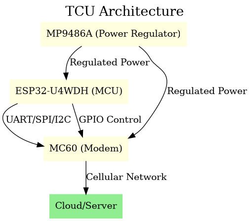
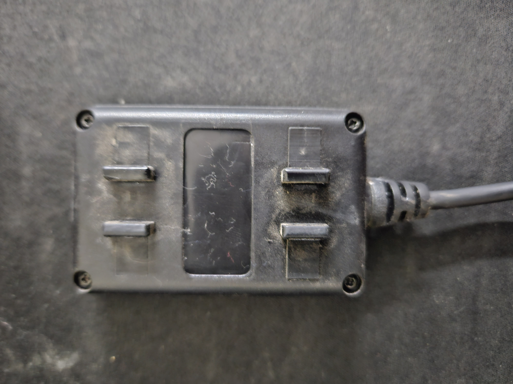

### Description of Files
- **`tcu-architecture.dot`**: Graphviz DOT file describing the TCU architecture.
- **`tcu-architecture.png`**: Rendered image of the TCU architecture.
- **`images/`**: Directory containing photos of the TCU hardware (top and bottom views, open and closed states).

---

## TCU Architecture Overview

The Ajjas Pro TCU architecture consists of the following key components:

1. **Power Regulator (MP9486A)**: Provides regulated power to the MCU and Modem.
2. **MCU (ESP32-U4WDH)**: The main microcontroller unit that communicates with the Modem and controls its operations.
3. **Modem (MC60)**: Handles cellular connectivity for communication with the cloud/server.
4. **Cloud/Server**: External system for data storage, processing, and analytics.

### Architecture Diagram

Below is the architecture diagram for the Ajjas Pro TCU:



---

## Hardware Photos

Here are some photos of the Ajjas Pro TCU hardware:

| **Closed Top** | **Closed Bottom** |
|----------------|-------------------|
|  |  |

| **Open Top** | **Open Bottom** |
|--------------|-----------------|
|  |  |
|  | |

---

## How to Use

1. **View the Architecture Diagram**:
   - The `tcu-architecture.dot` file can be rendered using Graphviz:
     ```bash
     dot -Tpng tcu-architecture.dot -o tcu-architecture.png
     ```
   - The pre-rendered `tcu-architecture.png` is also included in the repository.

2. **Explore Hardware Photos**:
   - The `images/` directory contains photos of the TCU hardware in various states (open/closed, top/bottom views).

---

## License

This project is licensed under the [MIT License](LICENSE).